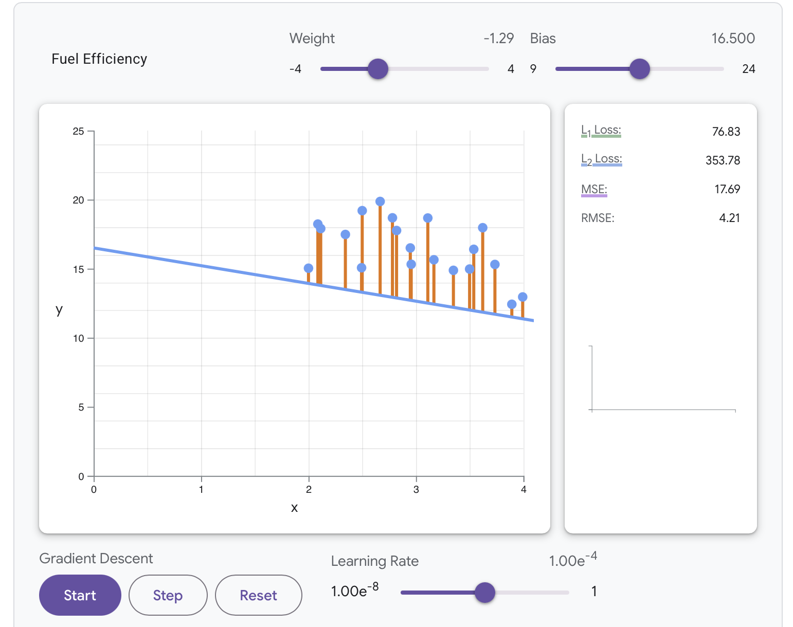

I dette forløb dykker vi ned i machine learning (ML). Vi skal se på grundbegreberne i ML og træne vores egen model med python. 

ML er ikke det samme som AI, men sin egen disciplin i genren af intelligente systemer.
Typiske formål med ML er fx

- Klassifikation 
- Regression
- Detektion
- Segmentering
- Generering
- Oversættelse
- Anomali-detektion

## Forløbet 
Vi begynder med Googles Teachable Machine som er en blød introduktion til faget. 

Derefter bygger vi vores egen model med YOLO. Til det formål bruger vi YOLO som er et framework til objektgenkendelse. Det specielle ved YOLO er at det behandler billedet i en iteration og ikke trinvis.

Vi bygger en model som kan genkende eller skelne mellem forskellig fysiske objekter eller bevægelser. 

Først skal modellen trænes, så vi opbygger et træningsæt af billeder. 

Når modellen er pålidelig, kan vi anvende outputtet i vores kode til at bygge interaktive installationer som reagerer på bestemte genstande. 

## Faglige begreber
Udover YOLO introducerer forløbet deep-learning biblioteker som fx TensorFlow og PyTorch, og vi arbejder med algoritmer som lineær regression, random forests og nearest neighbor. Vi taler også om forskellige typer af neurale netværk. 

Undervejs vil I støde på en lang række kernebegreber i ML, fx

- Recall
- Loss
- Outlier
- Precision
- Accuracy
- F1-score
- Bias
- Overfitting/underfitting
- Gradient Descent
- Learning rate
- Epoch
- Learning curve
- Noise
- Parameter
- Hyperparameter

## Demo
Dette projekt viser hvordan man med YOLO og en flask-server kan bruge objektdetektion til at genkende mobiltelefoner.

[Se demoprojekt Mobile Detector her](https://github.com/slotshaven-ddu/machine-learning-yolo/tree/main/mobile-detect)