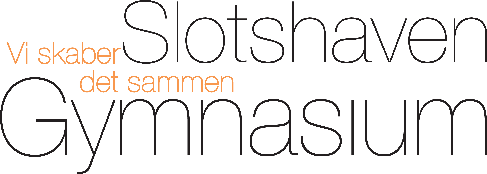

## Indledning
Markdown er ikke et formateringssprog.


## Symboler
### Logo
Logo som i dette dokument, med relativ eller absolut sti.
```
<p align="right"></p>
<p align="right"></p>
```

### Højre pil &rarr;
Kopier symbol eller denne kode
```
&rarr;
```

### Link ↗️
Eksternt link - kopier symbol eller denne kode (som er Unicode med modifier)
```
&#x2197;&#xFE0F;
```

### INtern link
Internt link 🔗 kan skrives med &#x1F517; (`&#x1F517;`)

```
&#x1F517;
```