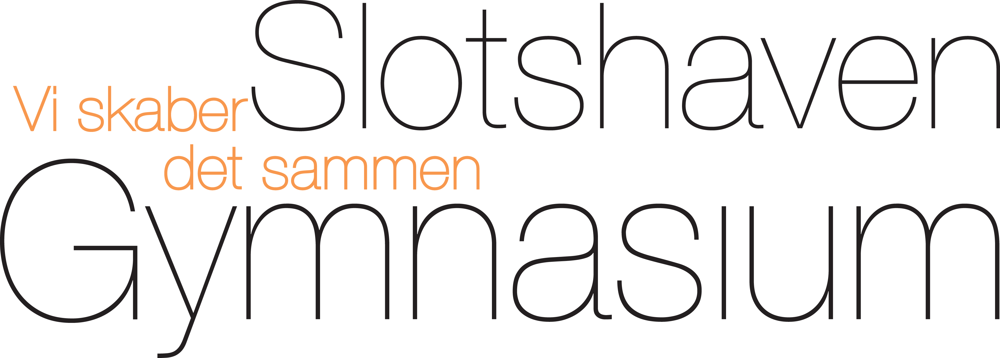

## Indledning

Markdown er ikke et formateringssprog. Det er en kortform af HTML.
Det er ikke et krav at man kender til markdown - det er blot et nyttigt redskab til dokumentation - især hvis man anvender GitHub til versionsstyring og kodedeling.

## Symboler

### Logo

Logo som i dette dokument, med relativ eller absolut sti.

```html
<p align="right"></p>
<p align="right"></p>
```

### Højre pil &rarr;

Kopier symbol eller denne kode

```markdown
&rarr;
```

### Link 1 ↗

Den nord-østlieg pil &#x2197; bruger vi internt link.

I markdown (kopier kode).

```markdown
&#x2197;
```

### Link 2 ↗️

Eksternt link - kopier symbol eller denne kode (som er Unicode med modifier)

I markdown (kopier kode).

```markdown
&#x2197;&#xFE0F;
```

### Link 3 🔗

Internt link 🔗 kan skrives med &#x1F517; (`&#x1F517;`)

I markdown (kopier kode).

``` markdown
&#x1F517;
```

## Flueben (checkmark)

Flueben (checkmark) ✓ kan skrives med &#x2713; (`&#x2713;`)

I markdown (kopier kode).

``` markdown
&#x2713;
```
